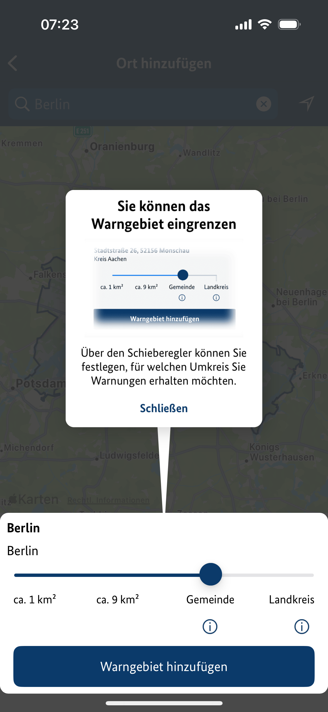
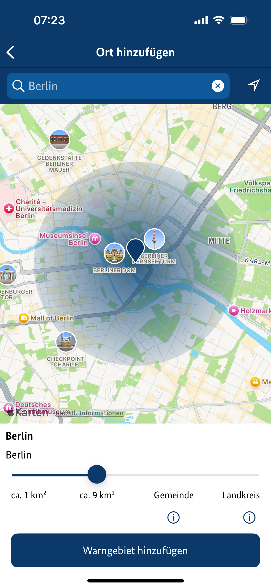
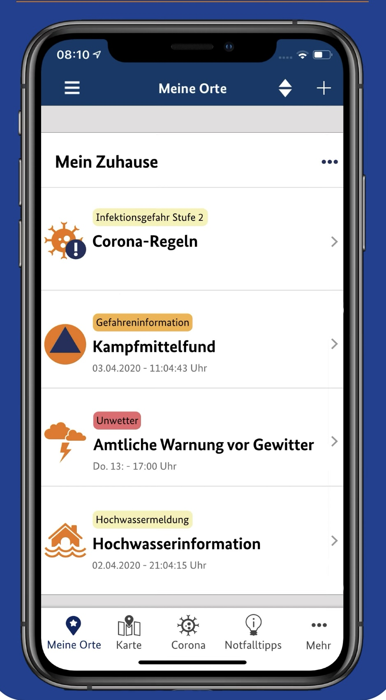
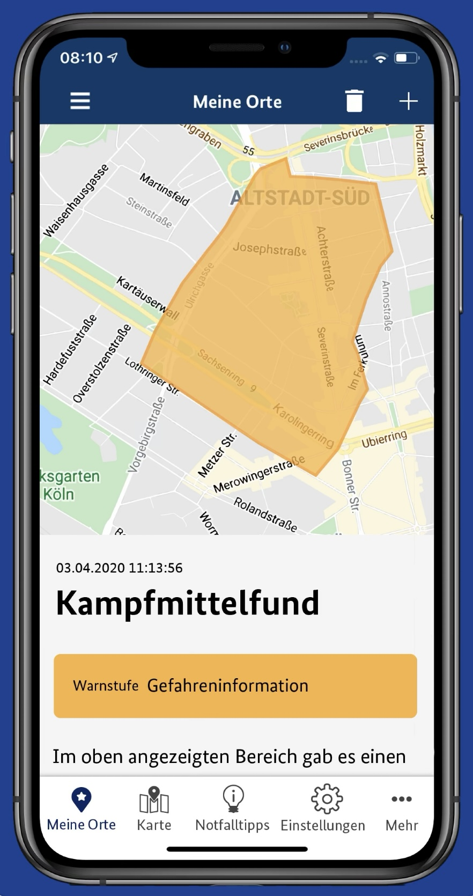
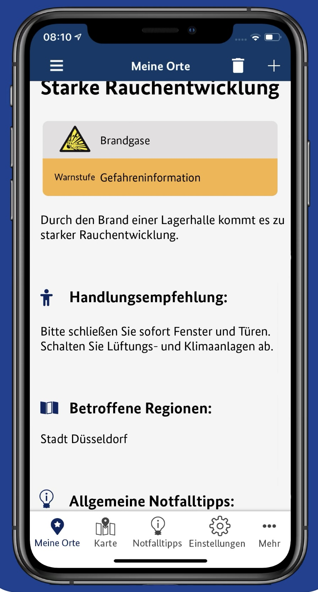
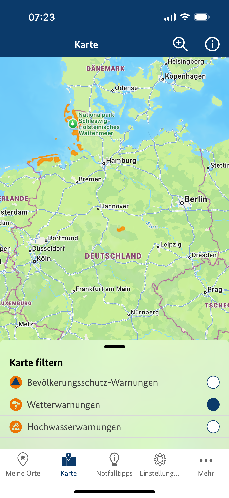
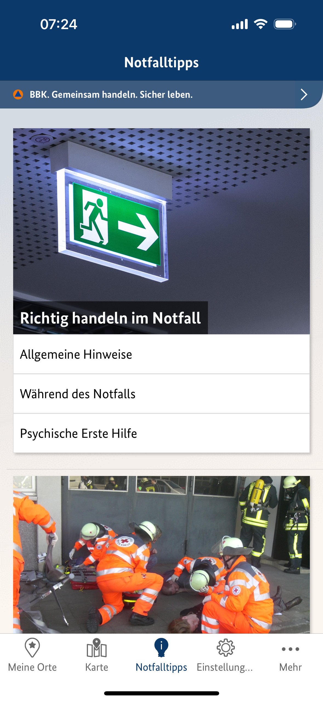
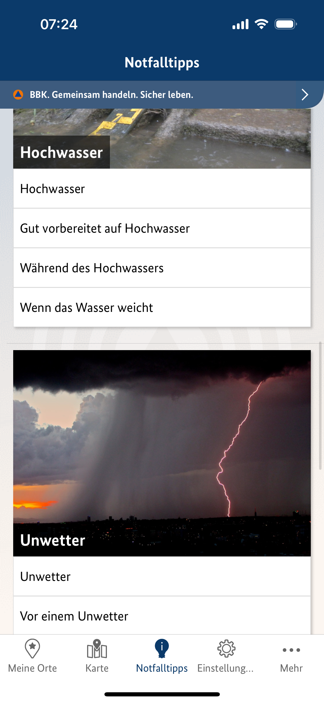
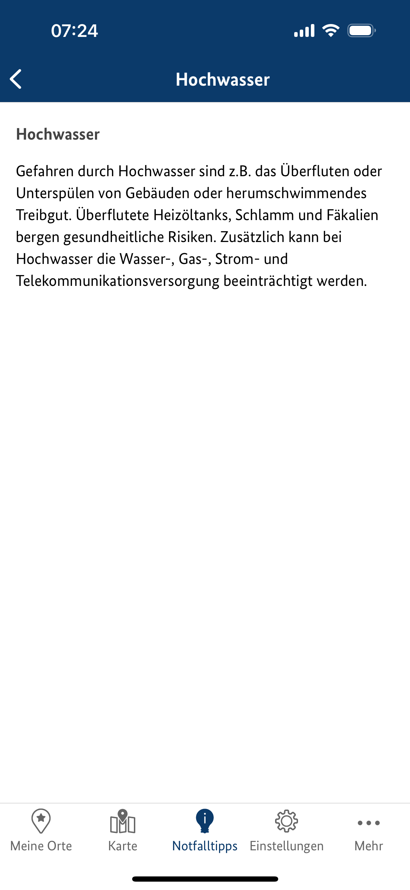

# NINA

국가: 독일
단계: 2. 준비 (preparedness)

- 독일 연방청(BBK)제공

**1. 주요 기능**

(1) 재난 경보 (폭풍, 홍수, 테러 등)
(2) 행동 지침
(3) 위치 기반 알림

지역 내 재난 알림 제공에 중점을 두고 있는 서비스
사용자 평가나 리뷰를 확인해보니 알림 자체에 ‘어떻게 대처하면 되는지’가 포함되어있진 않은 것 같고, 대신 별도의 탭에 재난상황별 대피 요령이 글로만 정리되어있는데 해당 파트 가시성이 떨어지고 보기 힘들다는 리뷰도 있습니다.

1. **사용자 주요 개선 요구 사항 (앱스토어 평가, 앱 사용해본 주변인 반응)**

(1) 하나의 특정 안전알림이 떴을 때 다른 상세 사항을 확인하다보면 그 과정에 **스크롤이 반복적으로 요구됨** → 개요를 빠르게 파악할 수 있는 UI로 빠르게 이동하고, 스크롤을 최소화할 수 있는 장치 요구

(2) **유사한 종류의 특정 상황이라면 어휘 통일** 필요
ex - 코로나 19 관련이라면 코로나규정/건강관련재해/감염위험 등의 복수의 단어가 포함된 푸쉬알림이 아닌 단순히 ‘감염병 알림’으로 표현을 통일한다든지

<aside>
🙃

전반적으로 등록한 지역 내에서 발령된 경보에 대한 정보를 모으고, 맵을 제공하는 단계까지는 긍정적 피드백이 많이 보이고 실제 써 봐도 명료하게 읽혔어요.

다만, 정보 제공 방식의 측면에서의 한계가 명확해보입니다. (실질적 행동요령 제공 미흡 등)
안전문자 모아보기 앱처럼 느껴진다는 개인적인 감상도 있었어요.

</aside>

---

하단 내비게이션 바 구성 : **현재 위치 - 지도 - 대처요령 - 설정 - 기타**

거의 **현재 위치**나 **전국구 지도 현황 확인 위주**로 사용하게 될 것으로 생각돼요.
대처 요령같은 것들은 사용성 좋게 구성돼있다기보단 단순 줄글 나열이라서 손이 잘 갈 것 같지는 않았습니다.

- 더 쉬운 말과 표현으로 제공되는 모드를 설정에서 고를 수 있습니다. (아동, 외국인 등 영어/독일어를 원활하게 사용하기 어려운 사람들을 위한 옵션) → 동일 UI에 단어들만 좀 더 쉬운 걸로 바뀝니다.

안전알림을 받을 범위를 반경 거리 별 범위 / 지역구 단위 등으로 파라미터 조절 가능

- 2군데 이상의 도시를 범위별로 조절해서 목록에 추가 가능
- 옵션에서 따로 현재 위치를 추적해 반영하도록 설정할 수도 있어요

지정된 ‘나의 지역’에 경보가 발령되면 재난 단계, 발령 시각과 함께 리스트업

발령 지역은 시각자료가 제공됩니다

안전알림이 도착한 시각 / 경보 발령 범위 / 짧은 대처요령 / 보편적 대처 팁 / 관련된 인근 지역 등…

지도 탭에서는 나라 전체 단위의 지도 상에서 시민보호안내(포괄적)/기상안내/홍수안내 등을 라디오버튼으로 필터링 → 지정된 내용의 경고가 발표된 지역이 색상으로 표시됩니다.

재난 유형 별 대처 방안 안내가 제공되어 있으나 너무 짧아 내용도 부족하고 엄청 글이 잘 들어오지도 않네요

(앱스토어 리뷰에서도 큰 도움은 되지 않았다는 평가가 있어요.)

---

- 알림을 받고 싶은 영역 범위를 특정 도시 내에서도 상황에 맞게 조절 가능한 점 + 복수 지역을 알림 받을 지역으로 등록 가능한 부분 → 재난 알림 대상 지역 맞춤 지정 가능
- 전국구 재난 상황은 지도로 시각화 + 내가 속한 지역의 상황은 안전알림 중심으로 탭을 분리해 짧고 간결한 정보 위주로 제공 (안전알림이 도착한 시각 / 경보 발령 범위 / 짧은 대처요령 / 보편적 대처 팁 / 관련된 인근 지역)